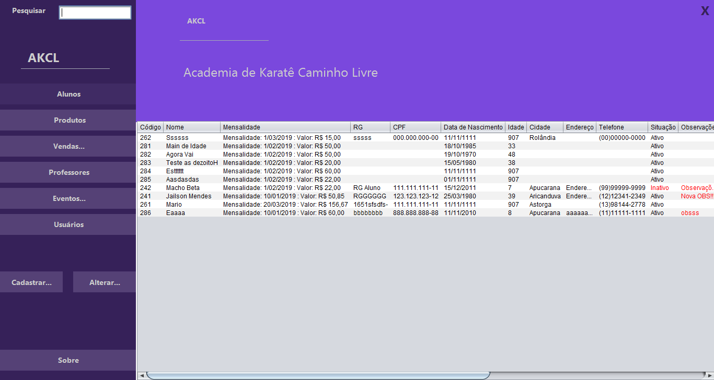

# AKCL

AKCL is a Karate Gym Management System I'v made for free for a karate gym in my current city.
It have been designed with [UML patterns](http://astah.net) and built along with Java programming language and Oracle Express database.

## Requirements

+ It have been developed with [NetBeans IDE 8.2](https://netbeans.org/downloads/8.2/). So, it's probably a good idea to import the code to this IDE.
+ Install [Java](https://www.java.com/en/download/)
+ Install [Oracle Express](https://www.oracle.com/technetwork/database/database-technologies/express-edition/downloads/index.html)
+ Check if the following path is in the System Variable's Path: *;C:\oraclexe\app\oracle\product*<strong>\xx.x.x\</strong>*server\bin*


```sql
Open CMD
>sqlplus /nolog
>connect /as sysdba
>alter user system identified by system;
>alter user hr identified by hr;
>disconnect
>connect system/system
>grant connect to hr;
>alter user hr account unlock;
>disconnect
>connect hr/hr
Copy and Paste createTable.txt content into CMD
>INSERT INTO tb_usuario(cod_usuario, tipo_usuario, login, senha, status)
>VALUES(cod_usuario_seq.nextval, "Admin","mylogin","mypass",1);
```

## Features

+ Intuitive interface
+ Working search form
+ Highlight important information
+ Student management with embedded monthly payment management
+ Instructor management
+ Sales and products management
+ Event management
+ System user management
+ Dual user type and privileges


